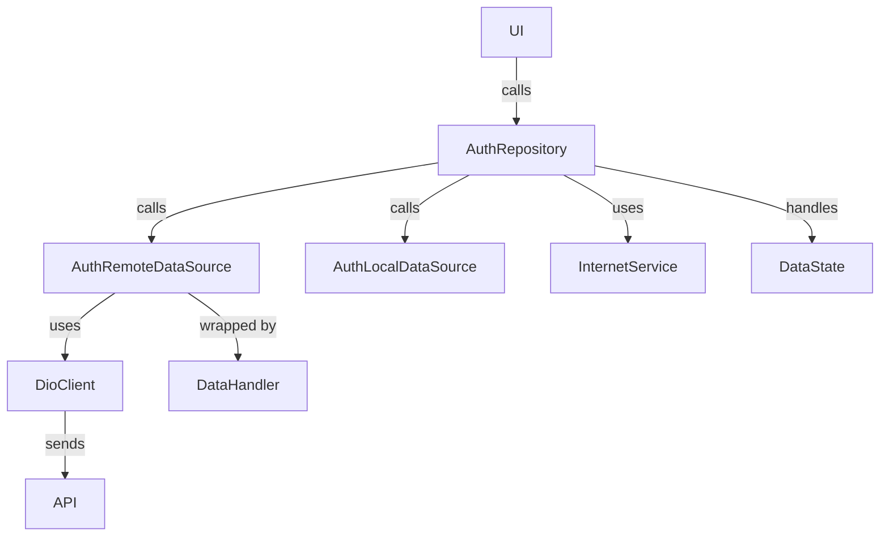

# Flutter Clean Architecture & SOLID Principles 🚀🚀🚀

A comprehensive guide to building scalable and maintainable Flutter applications using **Clean Architecture** and **SOLID Principles**.

---

## Table of Contents 📌

- [Flutter Clean Architecture \& SOLID Principles 🚀🚀🚀](#flutter-clean-architecture--solid-principles-)
  - [Table of Contents 📌](#table-of-contents-)
  - [What is Clean Architecture? 🏗️](#what-is-clean-architecture-️)
    - [Core Layers of Clean Architecture:](#core-layers-of-clean-architecture)
    - [Benefits of Clean Architecture:](#benefits-of-clean-architecture)
  - [What are SOLID Principles? 💡](#what-are-solid-principles-)
  - [Getting Started 🛠️](#getting-started-️)
  - [Project Features ✨](#project-features-)
  - [Feature Template Generation Using Mason 🧱](#feature-template-generation-using-mason-)
    - [Steps to Generate a New Feature Template](#steps-to-generate-a-new-feature-template)
    - [What do `cubit_feature` \& `cubit_page` Do?](#what-do-cubit_feature--cubit_page-do)
    - [Configuration](#configuration)
  - [Visual Representation 📊](#visual-representation-)
  - [Why Clean Architecture \& SOLID Principles? 🧩](#why-clean-architecture--solid-principles-)
  - [Overview of API Workflow Layers 🧱](#overview-of-api-workflow-layers-)
    - [Data Flow Summary 🔁](#data-flow-summary-)
    - [Core Components 📦](#core-components-)
      - [1. `AuthRepository`](#1-authrepository)
      - [2. `AuthRemoteDataSource`](#2-authremotedatasource)
      - [3. `DioClient`](#3-dioclient)
      - [4. `AuthInterceptor`](#4-authinterceptor)
      - [5. `DataHandler`](#5-datahandler)
      - [6. `ErrorHandler`](#6-errorhandler)
      - [7. `DataState<T>`](#7-datastatet)
    - [Example: Login Flow 🔄](#example-login-flow-)
      - [Internal Flow](#internal-flow)
    - [Benefits ✅](#benefits-)
    - [Debugging Tools 🔍](#debugging-tools-)
    - [Testing Tips 🧪](#testing-tips-)

## What is Clean Architecture? 🏗️

**Clean Architecture** is a software design philosophy that promotes separation of concerns through clearly defined layers. Each layer has a specific responsibility, making the codebase modular, testable, and easier to maintain.

### Core Layers of Clean Architecture:

1. **Presentation Layer**

   - Contains the UI and state management (e.g., Cubits, Widgets, Pages).
   - Responsible for displaying data and handling user interactions.

2. **Domain Layer**

   - The heart of the application. Contains **Entities**, **UseCases**, and **Repositories**.
   - Focuses purely on business logic, independent of frameworks.

3. **Data Layer**
   - Manages data sources (e.g., APIs, local databases).
   - Implements repositories to provide data to the domain layer.

### Benefits of Clean Architecture:

- Promotes **independence** from frameworks, UI, and external data sources.
- Ensures **modularity**, enabling easier testing and maintenance.
- Supports **scalability** and flexibility for future feature additions.

---

## What are SOLID Principles? 💡

**SOLID Principles** complement **Clean Architecture** by defining guidelines to write clean, maintainable, and extensible code. They are:

1. **S - Single Responsibility Principle (SRP)**  
   Each class should have only one responsibility or reason to change.

2. **O - Open/Closed Principle (OCP)**  
   Classes should be open for extension but closed for modification.

3. **L - Liskov Substitution Principle (LSP)**  
   Subtypes must be substitutable for their base types without altering the correctness of the program.

4. **I - Interface Segregation Principle (ISP)**  
   Classes should not be forced to implement interfaces they do not use.

5. **D - Dependency Inversion Principle (DIP)**  
   High-level modules should not depend on low-level modules; both should depend on abstractions.

---

## Getting Started 🛠️

```
lib/
│
├── config/
│   ├── routes/
│   │   ├── helper/
│   │   │   ├── auth_guard.dart
│   │   │   └── sliding_auto_route.dart
│   │   ├── route_data.dart
│   │   ├── routes.dart
│   │   └── routes.gr.dart
│   ├── theme/
│   │   ├── theme_data.dart
│   │   └── themes.dart
│
├── core/
│   ├── constants/
│   │   ├── api_endpoint.dart
│   │   ├── app_color.dart
│   │   └── app_icon.dart
│   ├── data/
│   │   ├── api/
│   │   │   ├── api_response.dart
│   │   │   ├── refresh_token_request.dart
│   │   │   └── refresh_token_response.dart
│   │   ├── errors/
│   │   │   ├── data_handler.dart
│   │   │   ├── error_handler.dart
│   │   │   └── error_types.dart
│   │   ├── states/
│   │   │   ├── data_state.dart
│   │   │   ├── failure_state.dart
│   │   │   ├── loading_state.dart
│   │   │   └── success_state.dart
│   ├── services/
│   │   ├── database/
│   │   │   └── isar_database_service.dart
│   │   │   └── local_database_service.dart
│   │   ├── dio/
│   │   │   ├── auth_interception.dart
│   │   │   ├── dio_client_dev.dart
│   │   │   ├── dio_client_prod.dart
│   │   │   ├── dio_client.dart
│   │   │   └── dio_multipart_client.dart
│   │   ├── image_picker/
│   │   │   └── image_picker_service.dart
│   │   ├── internet/
│   │   │   └── internet_service.dart
│   │   ├── message/
│   │   │   └── toast_message_service.dart
│   │   ├── navigation/
│   │   │   └── navigation_service.dart
│   │   └── user_data_service.dart
│   ├── utils/
│   │   ├── base_cubit/
│   │   │   ├── base_cubit_mixin.dart
│   │   │   └── base_cubit.dart
│   │   │   └── state_status.dart
│   │   ├── extensions/
│   │   │   ├── build_context_extension.dart
│   │   │   ├── double_extension.dart
│   │   │   ├── duration_extension.dart
│   │   │   ├── num_extension.dart
│   │   │   ├── page_controller_extension.dart
│   │   │   └── string_extension.dart
│   │   ├── screen_util/
│   │   │   ├── screen_type.dart
│   │   │   └── screen_util.dart
│   │   ├── use_case/
│   │   │   └── use_case.dart
│   │   ├── debounce_time.dart
│   │   ├── type_defs.dart
│   │   ├── ui_helper.dart
│   │   └── validator.dart
│
├── feature/
│   ├── app/
│   │   └── presentation/
│   │       ├── base_widgets/
│   │       ├── widgets/
│   ├── auth/
│   │   ├── data/
│   │   │   ├── models/
│   │   │   ├── data_sources/
│   │   │   └── repository_implementations/
│   │   ├── domain/
│   │   │   ├── entities/
│   │   │   ├── repositories/
│   │   │   └── use_cases/
│   │   └── presentation/
│   │       ├── cubits/
│   │       ├── pages/
│   │       └── widgets/
│   ├── dashboard/
│   │   └── ... (dashboard-specific files like auth feature)
│
├── injector/
│   ├── injector.config.dart
│   └── injector.dart
│
├── app_configuration.dart
├── application.dart
├── main_dev.dart
├── main_prod.dart
├── main_stg.dart
└── service_initializer.dart
```

---

## Project Features ✨

- 🛡️ **Use of SOLID Principles**: Ensuring scalable, maintainable, and testable code.
- 🏗️ **Clean Architecture**: Divides code into layers (Data, Domain, Presentation) for better separation of concerns.
- 🍴 **Build Flavors**: Seamless support for Development, Staging, and Production environments.
- 🔧 **Robust Error Handling**: Comprehensive API and internal error management mechanisms.
- 🔄 **Automated Request/Response Handling**: Including token refreshing and request inspection.
- 📡 **Core Services**:
  - Navigation, Internet, Local Database, Toast Messages, and User Credential management.
- 🎨 **Reusable UI Components**: Customizable themes and reusable widgets.
- ⚙️ **Utilities**:
  - Screen size handling, extensions, mixins, generics, and form validation utilities.

---

## Feature Template Generation Using Mason 🧱

This project uses **Mason** to generate feature templates for consistent and efficient development.

### Steps to Generate a New Feature Template

1. **Activate the `mason_cli` globally**:

   ```bash
   dart pub global activate mason_cli
   ```

2. **Fetch the bricks for the project**:

   ```bash
   mason get
   ```

3. **Generate a new feature using the `cubit_feature` brick**:

   ```bash
   mason make cubit_feature -c config.json
   ```

4. **Generate a new cubit and page using the `cubit_page` brick**:
   ```bash
   mason make cubit_page -c config.json
   ```

### What do `cubit_feature` & `cubit_page` Do?

The `cubit_feature` brick generates a feature template following the **Clean Architecture** structure, including:

- **Data Layer**:

  - Data Sources
  - Models
  - Repositories

- **Domain Layer**:

  - Entities
  - Repositories
  - Use cases

- **Presentation Layer**:

  - Cubits
  - Pages
  - Widgets

The `cubit_page` brick generates a cubit and a page templates inside the specified feature's presentation layer.

### Configuration

The generation process relies on a `config.json` file, which includes details such as feature, cubit, page names and entity name with it's variables type, name. Ensure that the `config.json` is correctly defined before running the generation command.

---

## Visual Representation 📊


> This diagram highlights the modular and scalable structure of Clean Architecture, aligning with **SOLID principles** to ensure the best development practices.

---

## Why Clean Architecture & SOLID Principles? 🧩

- **Improves Code Readability**: Clear separation of layers and responsibilities makes it easier to understand.
- **Simplifies Maintenance**: Modular code allows isolated changes with minimal risk.
- **Promotes Scalability**: Adding new features becomes seamless with a structured foundation.
- **Enhances Testing**: Decoupled modules and layers are more straightforward to test.

**Start your journey toward building robust and scalable Flutter applications today! 🚀**

---

## Overview of API Workflow Layers 🧱



---

### Data Flow Summary 🔁

1. **UI calls AuthRepository (e.g., login)**
2. **AuthRepository checks Internet availability** using `InternetService`
3. If online:
   - Calls `AuthRemoteDataSource`
   - `AuthRemoteDataSource` uses `DioClient` to make the HTTP request
   - Wraps response handling with `DataHandler.requestApi`
   - Errors are caught via `ErrorHandler`
4. If offline:
   - It can optionally fall back to `localCallback`

All outcomes are returned as **DataState<T>**: `SuccessState`, `FailureState`, or `LoadingState`.

---

### Core Components 📦

#### 1. `AuthRepository`

- Acts as the single source of truth for the domain layer.
- Decides when to fetch from remote or local.
- Uses `guardNetwork()` from `DataHandler` to handle connectivity gracefully.

#### 2. `AuthRemoteDataSource`

- Contains remote API methods like `login()` and `checkAuth()`.
- Makes network calls via `DioClient`.

#### 3. `DioClient`

- Abstract layer over Dio.
- Simplifies request methods like `get`, `post`, `put`, `patch`, `delete`.
- Adds Alice debugger & interceptor.

#### 4. `AuthInterceptor`

- Used in Dio to intercept and modify requests and responses.
- Automatically appends access tokens.
- Catches 401 responses and refreshes tokens before retrying failed requests.

#### 5. `DataHandler`

- Wraps remote calls in `requestApi()`.
- Validates and parses API responses.
- Handles `SuccessState`, `FailureState`, and JSON parsing.

#### 6. `ErrorHandler`

- Catches various error types (`DioException`, `FormatException`, `TypeError`, etc.)
- Converts errors into `FailureState` with meaningful messages.

#### 7. `DataState<T>`

- Sealed class for representing UI state.
- Types:
  - `SuccessState<T>`
  - `FailureState<T>`
  - `LoadingState<T>`

```dart
state.when(
  success: (data) => print("Got data"),
  failure: (msg, type) => print("Error: $msg"),
  loading: () => print("Loading..."),
);
```

---

### Example: Login Flow 🔄

```dart
final dataState = await authRepository.login(LoginRequest(email, password));

dataState.when(
  success: (user) => print("Login success"),
  failure: (msg, type) => print("Login failed: $msg"),
  loading: () => print("Logging in..."),
);

/// Or

if(dataState.hasData) {
   // Do something
} else if(dataState.hasError) {
   // Do something else
}
```

#### Internal Flow

```mermaid
graph TD
    A[UI] --> B[AuthRepository.login()]
    B -->|check internet| C[InternetService]
    B -->|calls| D[remoteDataSource.login()]
    D --> E[requestApi() via DioClient]
    E --> F[Handles structured response]
    F -->|success| G[SuccessState<User>]
    F -->|failure| H[FailureState]
```

---

### Benefits ✅

- **Decoupled Layers**: Easier testing and maintenance.
- **Unified Error Handling**: All API and type errors are gracefully caught.
- **Clean Network Management**: Internet check, retries, and fallback handled centrally.
- **Consistent UI State**: Always returns `DataState` for safe rendering.

---

### Debugging Tools 🔍

- **Alice** integrated into `DioClient` for easy request/response inspection

---

### Testing Tips 🧪

- You can mock `DioClient`, `AuthRemoteDataSource`, and `AuthRepository` easily.
- Test each layer in isolation.
