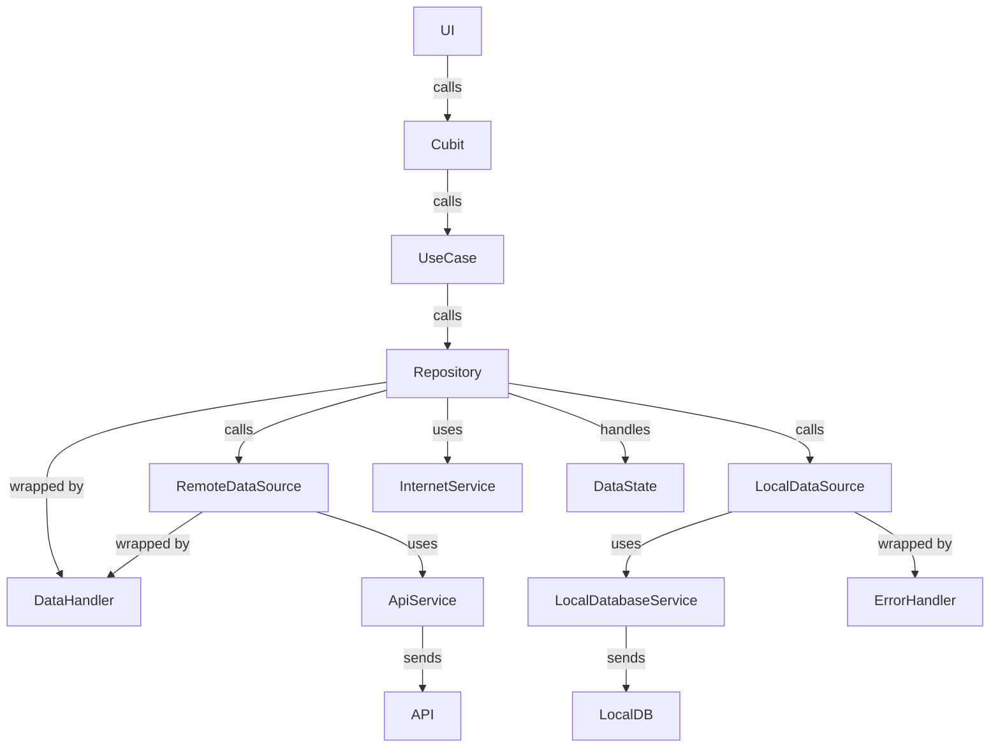
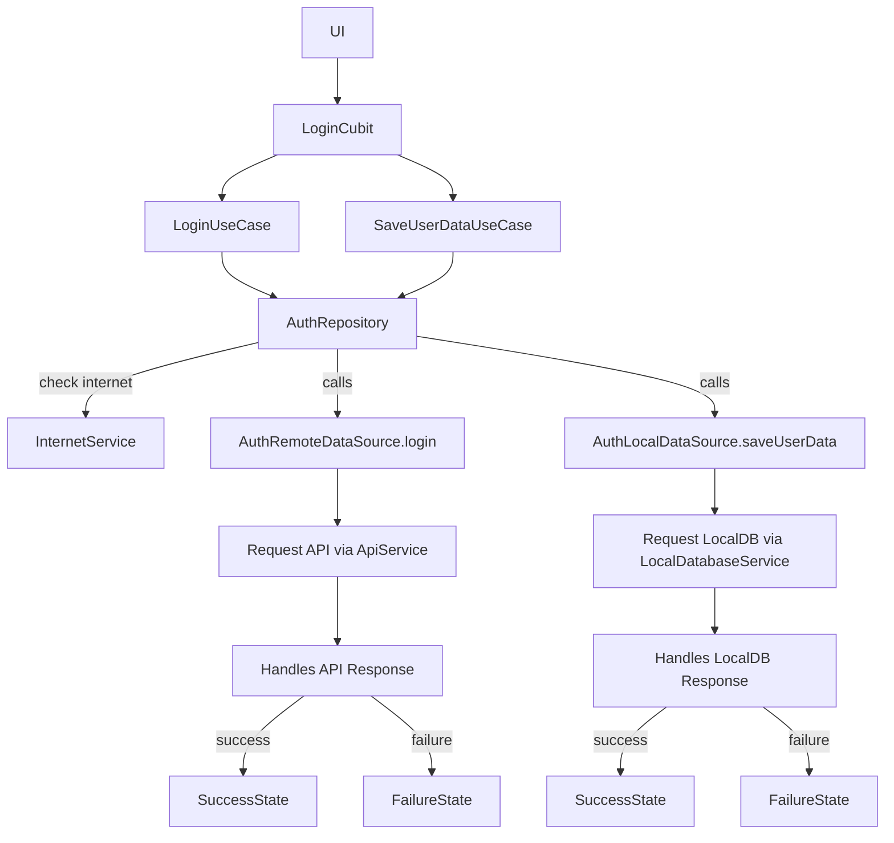

# Flutter Clean Architecture & SOLID Principles 🚀

A comprehensive guide to building scalable and maintainable Flutter applications using **Clean Architecture** and **SOLID Principles**.

---

## Table of Contents 📌

- [Flutter Clean Architecture \& SOLID Principles 🚀](#flutter-clean-architecture--solid-principles-)
  - [Table of Contents 📌](#table-of-contents-)
  - [Introduction](#introduction)
  - [What is Clean Architecture?](#what-is-clean-architecture)
    - [Core Layers](#core-layers)
    - [Benefits](#benefits)
  - [Visual Representation](#visual-representation)
  - [SOLID Principles](#solid-principles)
  - [Project Features](#project-features)
  - [Project Structure](#project-structure)
  - [Project Features](#project-features-1)
  - [Feature Template Generation with Mason](#feature-template-generation-with-mason)
    - [How to Generate a Feature](#how-to-generate-a-feature)
    - [What Do `cubit_feature` \& `cubit_page` Do?](#what-do-cubit_feature--cubit_page-do)
    - [Configuration](#configuration)
  - [Visual Representation](#visual-representation-1)
  - [API Workflow Overview](#api-workflow-overview)
    - [Data Flow Summary](#data-flow-summary)
    - [Core Components](#core-components)
      - [1. `Repository`](#1-repository)
      - [2. `RemoteDataSource`](#2-remotedatasource)
      - [3. `ApiService`](#3-apiservice)
      - [4. `Interceptor`](#4-interceptor)
      - [5. `LocalDataSource`](#5-localdatasource)
      - [6. `DataHandler`](#6-datahandler)
      - [7. `ErrorHandler`](#7-errorhandler)
      - [8. `DataState<T>`](#8-datastatet)
    - [Example: Login Flow](#example-login-flow)
      - [Internal Flow](#internal-flow)
    - [Benefits](#benefits-1)
    - [Debugging Tools](#debugging-tools)
    - [Testing Tips](#testing-tips)
  - [Developer Resources](#developer-resources)

---

## Introduction

This project demonstrates how to structure Flutter applications using **Clean Architecture** and **SOLID Principles**. The goal is to create modular, testable, and maintainable codebases that scale with your application's growth.

---

## What is Clean Architecture?

**Clean Architecture** is a software design philosophy that promotes separation of concerns through clearly defined layers. Each layer has a specific responsibility, making the codebase modular, testable, and easier to maintain.

### Core Layers

1. **Presentation Layer**

   - Contains UI and state management (e.g., Cubits, Widgets, Pages).
   - Responsible for displaying data and handling user interactions.

2. **Domain Layer**

   - The heart of the application. Contains **Entities**, **UseCases**, and **Repositories**.
   - Focuses purely on business logic, independent of frameworks.

3. **Data Layer**
   - Manages data sources (e.g., APIs, local databases).
   - Implements repositories to provide data to the domain layer.

### Benefits

- **Framework Independence**: Decouples business logic from frameworks, UI, and data sources.
- **Modularity**: Enables easier testing and maintenance.
- **Scalability**: Supports flexible and future-proof feature additions.

---

## Visual Representation

!Clean Architecture With SOLID Principle

> This diagram highlights the modular and scalable structure of Clean Architecture, aligning with **SOLID principles** to ensure best development practices.

---

## SOLID Principles

**SOLID Principles** complement Clean Architecture by providing guidelines for writing clean, maintainable, and extensible code:

1. **Single Responsibility Principle (SRP)**  
   Each class should have only one reason to change.

2. **Open/Closed Principle (OCP)**  
   Classes should be open for extension but closed for modification.

3. **Liskov Substitution Principle (LSP)**  
   Subtypes must be substitutable for their base types without altering program correctness.

4. **Interface Segregation Principle (ISP)**  
   Classes should not be forced to implement interfaces they do not use.

5. **Dependency Inversion Principle (DIP)**  
   High-level modules should not depend on low-level modules; both should depend on abstractions.

For more detailed information and real-world examples, see the [**SOLID Principles documentation**](documentation/solid_principles.md).

---

## Project Features

- 🛡️ **SOLID Principles**: Ensures scalable, maintainable, and testable code.
- 🏗️ **Clean Architecture**: Divides code into layers (Data, Domain, Presentation) for clear separation of concerns.
- 🍴 **Build Flavors**: Supports Development, Staging, and Production environments.
- 🔧 **Robust Error Handling**: Comprehensive API and internal error management.
- 🔄 **Automated Request/Response Handling**: Includes token refreshing and request inspection.
- 📡 **Core Services**: Navigation, Internet, Local Database, Toast Messages, and User Credential management.
- 🎨 **Reusable UI Components**: Customizable themes and reusable widgets.
- ⚙️ **Utilities**: Screen size handling, extensions, mixins, generics, and form validation utilities.

---

## Project Structure

```
lib/
├── core/
│   ├── config/
│   │   ├── routes/
│   │   │   ├── guards/
│   │   │   ├── helper/
│   │   │   ├── routes.dart
│   │   │   └── routes.gr.dart
│   │   ├── theme/
│   │   │   ├── theme_data.dart
│   │   │   └── themes.dart
│   ├── constants/
│   ├── data/models/
│   ├── data_handling/
│   ├── data_states/
│   ├── domain/entities/
│   ├── services/
│   └── utils/
├── features/
│   ├── auth/
│   ├── dashboard/
│   ├── .....
├── injector/
│   ├── injector.config.dart
│   └── injector.dart
├── shared/
│   ├── models/
│   └── widgets/
├── app_config.dart
├── app_initializer.dart
├── application.dart
├── main_dev.dart
├── main.dart
├── main_stg.dart
```

---

## Project Features

- 🛡️ **SOLID Principles**: Ensures scalable, maintainable, and testable code.
- 🏗️ **Clean Architecture**: Divides code into layers (Data, Domain, Presentation) for clear separation of concerns.
- 🍴 **Build Flavors**: Supports Development, Staging, and Production environments.
- 🔧 **Robust Error Handling**: Comprehensive API and internal error management.
- 🔄 **Automated Request/Response Handling**: Includes token refreshing and request inspection.
- 📡 **Core Services**: Navigation, Internet, Local Database, Toast Messages, and User Credential management.
- 🎨 **Reusable UI Components**: Customizable themes and reusable widgets.
- ⚙️ **Utilities**: Screen size handling, extensions, mixins, generics, and form validation utilities.

---

## Feature Template Generation with Mason

This project uses **Mason** to generate feature templates for consistent and efficient development.

### How to Generate a Feature

1. **Activate the `mason_cli` globally**:

   ```bash
   dart pub global activate mason_cli
   ```

2. **Fetch the bricks for the project**:

   ```bash
   mason get
   ```

3. **Generate a new feature using the `cubit_feature` brick**:

   ```bash
   mason make cubit_feature -c config.json
   ```

4. **Generate a new cubit and page using the `cubit_page` brick**:

   ```bash
   mason make cubit_page -c config.json
   ```

### What Do `cubit_feature` & `cubit_page` Do?

- **`cubit_feature`**: Generates a feature template following Clean Architecture, including:

  - **Data Layer**: Data Sources, Models, Repositories
  - **Domain Layer**: Entities, Repositories, Use Cases
  - **Presentation Layer**: Cubits, Pages, Widgets

- **`cubit_page`**: Generates a cubit and page template inside the specified feature's presentation layer.

### Configuration

The generation process relies on a `config.json` file, which includes details such as feature, cubit, and page names, as well as entity names and their variable types. Ensure that `config.json` is correctly defined before running the generation command.

---

## Visual Representation


> This diagram highlights the modular and scalable structure of Clean Architecture, aligning with **SOLID principles** to ensure best development practices.

---

## API Workflow Overview

### Data Flow Summary



1. **UI calls Cubit, which calls UseCase**
2. **UseCase calls Repository**
3. **Repository checks Internet availability** using `InternetService`
4. If online:
   - Calls `RemoteDataSource`
   - `RemoteDataSource` uses `ApiService` to make HTTP requests
   - Response handling is wrapped with `DataHandler.safeApiCall`
   - Errors are caught via `ErrorHandler`
5. If offline:
   - Optionally falls back to `localCallback` using `LocalDataSource`
6. **Repository may also call `LocalDataSource`** directly
7. **All outcomes are returned as `DataState<T>`**: `SuccessState`, or `FailureState`

---

### Core Components

#### 1. `Repository`

- Acts as the single source of truth for the domain layer.
- Decides when to fetch from remote or local sources.
- Uses `fetchWithFallback()` from `DataHandler` for connectivity handling.

#### 2. `RemoteDataSource`

- Contains remote API methods.
- Makes network calls via `ApiService`.

#### 3. `ApiService`

- Abstracts over Dio for HTTP requests.
- Simplifies request methods and adds debugging/interception.

#### 4. `Interceptor`

- Intercepts and modifies requests/responses.
- Appends access tokens and handles token refresh on 401 responses.

#### 5. `LocalDataSource`

- Manages local data using `LocalDatabaseService`.
- Used for fallback or offline storage.

#### 6. `DataHandler`

- Wraps remote calls in `safeApiCall()`.
- Validates and parses API responses.
- Handles `SuccessState`, `FailureState`, and JSON parsing.

#### 7. `ErrorHandler`

- Catches various error types and converts them into `FailureState` with meaningful messages.

#### 8. `DataState<T>`

- Represents UI state as a sealed class:
  - `SuccessState<T>`
  - `FailureState<T>`
  - `LoadingState<T>`

```dart
state.when(
  success: (data) => print("Got data"),
  failure: (msg, type) => print("Error: $msg"),
  loading: () => print("Loading..."),
);
```

---

### Example: Login Flow

```dart
@injectable
class LoginCubit extends BaseCubit<LoginState> {
  final LoginCubitUseCases _useCases;

  LoginCubit({
    required LoginCubitUseCases useCases,
  })  : _useCases = useCases,
        super(const LoginState.initial());

  Future<void> login({required String username, required String password}) async {
    final dataState = await _useCases.login.call(
      LoginRequest(username: "", password: ""),
    );

    dataState.when(
      success: (user) => print("Login success"),
      failure: (msg, type) => print("Login failed: $msg"),
      loading: () => print("Logging in..."),
    );

    if (dataState.hasData) {
      saveUserData(dataState.data!);
    } else if (dataState.hasError) {
      // Handle error
    }
  }

  Future<void> saveUserData(UserData userData) async {
    final dataState = await _useCases.saveUserData.call(userData);

    if (dataState.hasData) {
      // Handle success
    } else if (dataState.hasError) {
      // Handle error
    }
  }
}
```

#### Internal Flow



---

### Benefits

- **Decoupled Layers**: Easier testing and maintenance.
- **Unified Error Handling**: All API and type errors are gracefully caught.
- **Clean Network Management**: Internet checks, retries, and fallback handled centrally.
- **Consistent UI State**: Always returns `DataState` for safe rendering.

---

### Debugging Tools

- **Alice** integrated into `ApiService` for easy request/response inspection.

---

### Testing Tips

- Mock `ApiService`, `AuthRemoteDataSource`, and `AuthRepository` easily.
- Test each layer in isolation.

---

## Developer Resources

For more details on specific commands and guidelines, refer to the following documents:

- [**Docker Commands**](docs/docker_commands.md): Essential Docker and Docker Compose commands for development environments.
- [**Flutter Commands Cheat Sheet**](docs/flutter_commands_cheat_sheet.md): A collection of essential and frequently used Flutter commands to boost your productivity.
- [**Flutter Configuration Guidelines**](docs/flutter_configuration_guidelines.md): Guidelines for setting up the Flutter environment, including activating pub commands, configuring Firebase CLI, and managing the Java SDK location.
- [**Git Commands Cheat Sheet**](docs/git_commands_cheat_sheet.md): A collection of essential and frequently used git commands to boost your productivity.
